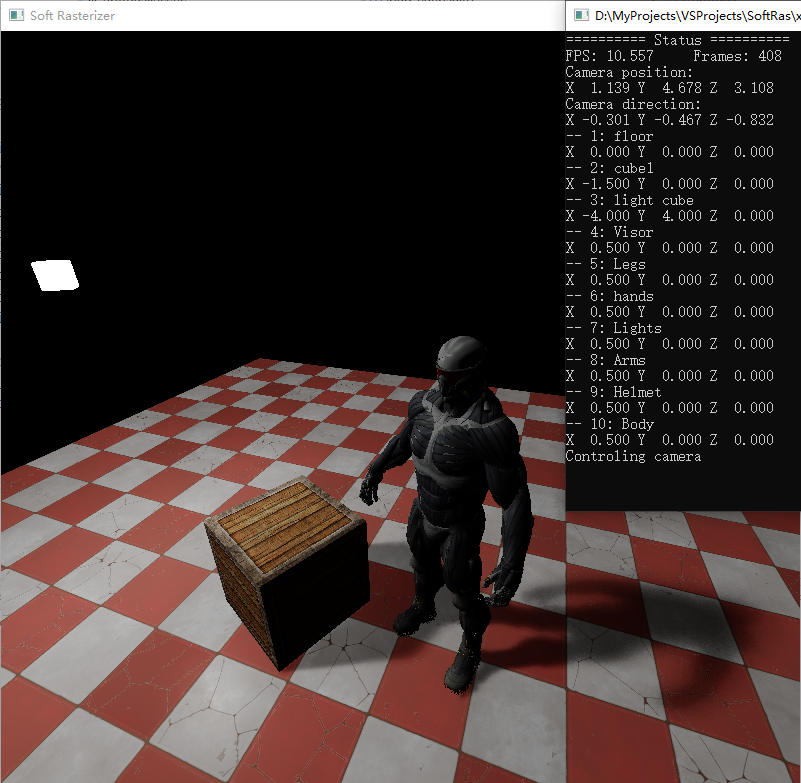
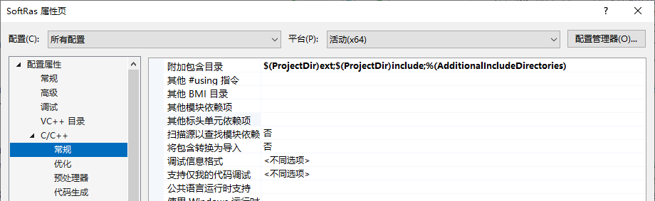
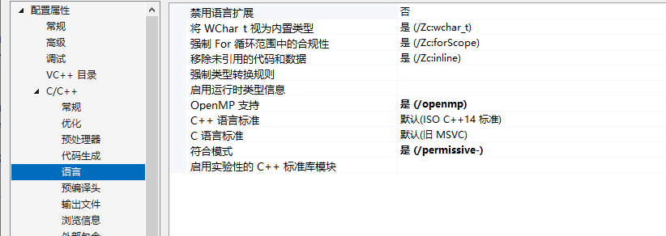
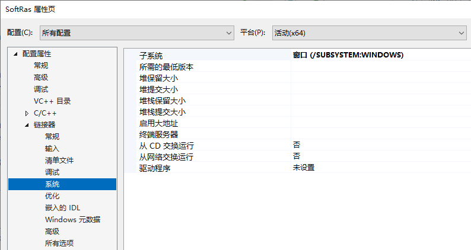
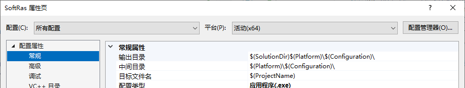
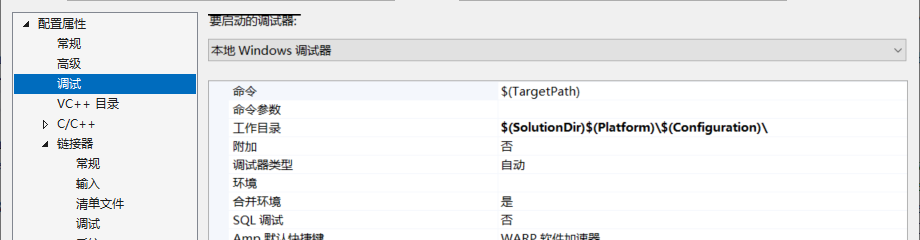
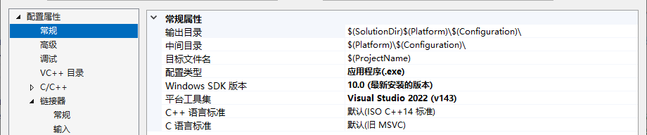

# Soft Rasterizer

使用 C++ 实现的一个软件光栅化器及渲染管线，未使用任何图形 API。展示：



**实现内容：**

- 软光栅化器，特性包括：
  - 深度测试
  - 表面剔除
  - 多渲染目标
  - 可编程渲染管线
  - 纹理
  - OpenMP 并行光栅化
- 含阴影的简单光照渲染管线，支持：
  - 方向光源、点光源
  - 硬阴影、PCSS 软阴影
  - 纹理材质
  - obj 模型和 mtl 材质读取
  - Blinn-Phong 着色
  - 后处理特效，例如 tonemapping、blur 等，也可由用户自己写后处理 shader
- 可操纵 ui 界面和一个 console 用于查看 FPS 等状态，支持：
  - 查看 FPS 和帧数
  - 操控相机浏览
  - 查看各个 mesh 的位置，并能移动各个 mesh
  - 控制阴影、后处理等的开启和关闭
- 数学库等其他用到的部分


## 说明

**操作说明：**

WSAD 控制相机移动，EQ控制相机上升、下降，鼠标左键拖拽移动相机视角。

控制台上显示场景中各个物体编号，按下键盘上方对应数字键，即可控制该物体，使用 WSADEQ 控制物体移动，ZX 控制物体沿 Y 轴旋转。按 0 或者鼠标左键回到控制摄像机。

F1 开启/关闭阴影，F2 切换软/硬阴影，F3 开启/关闭后处理，F4 切换后处理（目前支持模糊、黑白两种效果），F5 开启/关闭方向光源，F6 开启/关闭点光源

**其他说明：**

可以更改 defines.h 中的 SR_PARALLEL_RASTERIZE 宏来指定是否使用 OpenMP 并行光栅化。但需要重新 build。建议使用并行，不然帧数太低

可以更改 Scene.h/.cpp 里的 init* 函数来生成不同场景，具体可自行查看。

可以更改 renderer.h/.cpp 和 shader.h/.cpp 来更改渲染管线或添加新 shader 等。

操控物体移动本质是更改物体指向 Transform 中的平移向量，如果不同编号物体指向同一个 Transform，则会同时被移动（因此 demo 中 nanosuit 模型包含的多个 mesh 会同时移动）


## Build

**requirements：**

- Windows 10
- Visual Studio 2019 or higher

直接构建 Visual Studio 工程即可。右键 SoftRas 工程属性，工程属性需满足以下要求：

1. 附加包含目录如下



2. OpenMP 支持：是



3. 子系统选择：窗口



另外，尽量保证 VS 调试时工作目录就是生成的 exe 文件目录，这样 resources 文件加载时路径不容易出错。如下：





（调试工作目录与输出目录相同）

另外，确认平台工具集已安装，若采用旧版本 VS，要注意平台工具集选择已经安装的版本。（VS2022 为 v143，VS2019 为 v142）




## 渲染流程说明及代码介绍

主要介绍主要框架和几个关键部分的代码。

### 框架

- main.cpp：程序入口，定义 win32 窗口，控制台等
- context.h/cpp：渲染管线的上下文环境，全局的。包括所有的帧缓存、Shader、纹理，以及深度测试、视口等状态，并包括光栅化需要的一些 buffer（如顶点着色器输出）。负责进行光栅化、创建纹理、FBO等
- renderer.h/cpp：渲染管线，全局的。包括渲染管线的状态（如是否开启阴影等）、渲染的场景等。负责每一帧渲染、用户输入输出等
- scene.h/cpp：场景信息，属于 Renderer。包括所有的 mesh、material、transform，每个 mesh instance 对应的模型、材质、变换，以及光照、相机等。负责加载场景
- framebuffer.h/cpp：帧缓存，属于 Context，可以通过 Context 进行创建、访问、绑定等
- shader.h/cpp：着色器。在外部创建（一般由 Renderer），Context 负责绑定。用户可以自己编写 `YourOwnShader : public Shader {...}`
- texture.h/cpp：纹理。通过 Context 进行创建、访问。也可以加载外部图片
- maths.h/cpp：数学库
- defines.h：一些宏和常数

### 渲染管线

每一帧调用`Renderer::draw`进行场景渲染

```c++
void Renderer::draw()
{
    /* draw shadow map */
    g_ctx.enable(SR_FLAG_CULL_FRONT);
    g_ctx.bindShader(m_shader_id[1]); // shadowmap shader
    ...
    g_ctx.setViewport({ 0, 0, 600, 600 }); // shadowmap size
    auto& light = m_scene.m_dirlight;
    mat4&& light_view = lookAt({ 0.0f, 0.0f, 0.0f }, light.dir, { 0.0f, 1.0f, 0.0f });
    ...
    for (auto& inst : m_scene.m_insts) {
        ...
        g_ctx.drawTrianglesIndexed(...);
    }

    /* main draw */
    g_ctx.enable(SR_FLAG_CULL_BACK);
    g_ctx.bindShader(m_shader_id[0]); // forward shader
    ...
    g_ctx.setViewport({ 0, 0, 800, 800 }); // window size
    Camera& cam = m_scene.m_camera;
    mat4&& view = cam.computeViewMat();
    mat4&& proj = cam.computeProjMat();
    // uniforms
    g_ctx.getShader()->getVars()->m4[1] = proj.matmul(view);
    g_ctx.getShader()->getVars()->m4[2] = light_view_proj;
    g_ctx.getShader()->getVars()->f3[0] = cam.pos;
    ...

    for (auto& inst : m_scene.m_insts) {
        // model transform
        g_ctx.getShader()->getVars()->m4[0] = ...;
        ...
        // material
        g_ctx.getShader()->getVars()->i1[0] = m_scene.m_mats[inst.mat_id].diff_tex;
        ...
        // draw mesh
        auto& mesh = m_scene.m_meshes[inst.mesh_id];
        g_ctx.drawTrianglesIndexed(...);
    }

    /* postprocess */
    if (b_postprocess) {
        g_ctx.bindShader(m_shader_id[2]);
        ...
        g_ctx.drawScreen();
    }
}
```

### 光栅化部分

在`Renderer::draw`中，从 Scene 加载好模型，并指定好 Shader、Uniform 等，将顶点、索引序列，传入 `Context::drawTrianglesIndexed`。

```c++
void Context::drawTrianglesIndexed(Vertex* vertices, uint* indices, uint amount)
{
    ...
    for (uint i = 0; i < amount; i++) {
        /* Vertex shader, from vertex attribute to vertex_out_buffer */
        ...
        m_shader->vertexShader(vertices + id0, { vo_p[0] });
        m_shader->vertexShader(vertices + id1, { vo_p[1] });
        m_shader->vertexShader(vertices + id2, { vo_p[2] });
        ...
        /* clip proc */
        ...
        // if a point outside clip plane, generate a new vertex, raster 2 triangle
        if (out_n == 1) {
            ...
            rasterTriangle(vo_p[out_v[0]], vo_p[in_v[0]], vo_p[in_v[1]]);
            rasterTriangle(vo_p[out_v[0]], vo_p[in_v[1]], v_buf);
            continue;
        }
        // if 2 point outside clip plane, clip 2 point to plane, then become no point outside
        else if (out_n == 2) {
            // compute clip coordinate
            ...
        }
        // no point ouside
        rasterTriangle(vo_p[0], vo_p[1], vo_p[2]);
    }
}
bool Context::rasterTriangle(float* v0_buf, float* v1_buf, float* v2_buf)
{
    // perspective divide
    vec4 v0{ v0_buf[0] / v0_buf[3], v0_buf[1] / v0_buf[3], v0_buf[2] / v0_buf[3], 1.0f / v0_buf[3] };
    ...
    // cull face
    ...
    // clip space: [-1,1]*[-1,1]*[0,1]
    AABB tri_bb{ {v0.x, v0.y, v0.z}, {v0.x, v0.y, v0.z} };
    ...
    // viewport transform
    uvec4 vp = getViewport();
    AABB2 view_bb;
    ...
    // pre-interpolate barycentric2D
    const float denom = ...;
    ...
    // main proc
#ifdef SR_PARALLEL_RASTERIZE
    ...
#else
    float* f_buf = m_fs_in_block;
    vec4* f_out_buf = m_fs_out_block;
    for (float y = view_bb.bb_min.y; y < view_bb.bb_max.y; y += 1.0f) {
#endif
        bool has_inter = false;
        for (float x = view_bb.bb_min.x; x < view_bb.bb_max.x; x += 1.0f) {
            ...
            f_buf[0] = x + 0.5f;
            f_buf[1] = y + 0.5f;
            vec2&& p{ f_buf[0], f_buf[1] };
            // barycentric2D
            const vec3 b_cd = ...;
            ...
            // first interpolate frag.zw then depth test
            f_buf[2] = interpolate(b_cd, v0.z, v1.z, v2.z);
            f_buf[3] = interpolate(b_cd, v0.w, v1.w, v2.w);
            if (f_buf[2] < 0.0f || f_buf[2] > 1.0f) {
                continue;
            }
            else if (b_depth_test && m_framebuffer->hasDepthBuffer()) {
            	// depth testing, f_buf[0,1,2] = (x,y,depth)
                ...
            }
            // interpolate remain props with fixed-barycentric2D
            ...
            /* Fragment Shader and write framebuffer */
            m_shader->fragmentShader({ f_buf, (uint)p.x, (uint)p.y }, { f_out_buf });
            ...
        }
    }
    return true;
}
```

### 主要 Shader

`Context::drawTrianglesIndexed`会调用`Shader::vertexShader`和`Shader::fragmentShader`。介绍一个最主要的 Draw Call 中的使用的 shader，即`ForwardShader`。shader 使用 Blinn-Phong 的着色，但是 demo 各个模型的材质并不统一，着色结果不一定准确

```c++
void ForwardShader::vertexShader(Vertex* vertex, VSOut vs_out)
{
    // m_vars is uniforms
    mat4& model = m_vars->m4[0];
    mat4& viewproj = m_vars->m4[1];
    vec3& sc = m_vars->f3[8]; // scale, used for normal transform computing

    // transform
    vec4 h_pos{ vertex->pos.x, vertex->pos.y, vertex->pos.z, 1.0f };
    vec4 h_world_pos = model.dot(h_pos);
    vec4 np = viewproj.dot(h_world_pos);

    // vs_out.data is a varying length float array
    vec4* out_ndc_pos = (vec4*)vs_out.data;
    ...
    *out_ndc_pos = vec4{ np.x, np.y, np.z, np.w };
    *out_world_pos = vec3{ h_world_pos.x, h_world_pos.y, h_world_pos.z };
    *out_color = vertex->color;
    *out_normal = model.dot(vec3{ vertex->norm.x / (sc.x * sc.x), vertex->norm.y / (sc.y * sc.y), vertex->norm.z / (sc.z * sc.z) });
    *out_texcoord = vertex->uv;
}
void ForwardShader::fragmentShader(FSIn fs_in, FSOut fs_out)
{
    // from vertex shader
    vec3 pos{ fs_in.data[4], fs_in.data[5], fs_in.data[6] };
    vec3 norm = normalize(vec3{ fs_in.data[10], fs_in.data[11], fs_in.data[12] });
    vec2 uv{ fs_in.data[13], fs_in.data[14] };
    // uniforms
    mat4& lt_viewproj	= m_vars->m4[2];
    vec3& cam_pos		= m_vars->f3[0];
    ...
    int& diff_tex_id	= m_vars->i1[0];
    ...
    bool& enable_shadow = m_vars->b[2];
    ...
    // textures
    Texture* diff_tex	= diff_tex_id >= 0 ? m_vars->t[diff_tex_id] : nullptr;
    Texture* spec_tex	= spec_tex_id >= 0 ? m_vars->t[spec_tex_id] : nullptr;
    Texture* shadowmap	= shadowmap_id >= 0 ? m_vars->t[shadowmap_id] : nullptr;

    ...
    // if has texture material
    if (diff_tex) {
        vec4 diff = diff_tex->sample(uv.x, uv.y);
        diffuse = vec3{ diff.x, diff.y, diff.z };
    }
    ...
    if (has_dirlight) {
        // dir light
        ...
        // shadow
        float vis = 1.0f;
        if (enable_shadow && shadowmap) {
            ...
                if (!soft_shadow) {
                    // hard shadow
                    if (z_lt > z_sm + bias) {
                        vis = 0.0f;
                    }
                }
                else {
                    // pcss soft shadow
                    // light size and sample amount can be changed
                    const float light_size = 0.03f;
                    const int sample_n1 = 18, sample_n2 = 36;
                    // compute blocker depth
                    ...
                    for (int i = 0; i < sample_n1; i++) {
                        ...
                    }
                    // has blocker, compute visibility
                    if (blk_n > 0) {
                        ...
                        float nvis = 0.0f;
                        for (int i = 0; i < sample_n2; i++) {
                            ...
                        }
                        vis = nvis / (float)sample_n2;
                    }
                }
            }
        }
        ...
    }
    if (has_ptlight) {
        // point light
        ...
    }
    vec3 out_color = (irra + toVec3(emissive)) * diffuse;
    out_color = ACESTonemapping(out_color); // tonemap
    out_color = clamp(out_color, 0.0f, 1.0f);
    fs_out.data[0] = vec4{ out_color.x, out_color.y, out_color.z, 1.0f };
}
```

### 其他

一些重要的类：

```c++
// Scene.h

class Material {
public:
    vec3 diffuse;
    vec3 specular;
    int diff_tex = -1;
    int spec_tex = -1;
};

class Mesh {
public:
    std::vector<Vertex> vertices;
    std::vector<uint> indices;
};

class Transform {
public:
    vec3 trans;
    vec3 rotate;
    vec3 scale;

    mat4 computeMat();
};

class Camera {
public:
    vec3 pos;
    vec3 front;
    vec3 up;
    vec3 right;
    float pitch, yaw;
    float fov, aspect, nearz, farz;

    void init(...);
    mat4 computeViewMat();
    mat4 computeProjMat();
    ...
};

class DirLight {
public:
    vec3 color;
    vec3 dir;
};

class PointLight {
public:
    vec3 color;
    vec3 pos;
    vec3 dir;
    vec3 decay;
};

class Scene {
public:
    Scene() {};
    ~Scene() {};

    void init();
    void clear();

    // demo scene
    void init_cube_scene();
    void init_nanosuit_scene();
    ...

    struct Instance
    {
        uint mat_id;
        uint mesh_id;
        uint trans_id;
        const char* name;
    };

    std::vector<Instance> m_insts;
    std::vector<Material> m_mats;
    std::vector<Mesh> m_meshes;
    std::vector<Transform> m_trans;
    DirLight m_dirlight;
    PointLight m_ptlight;
    Camera m_camera;

    // scene option
    bool b_has_dirlight = true;
    bool b_has_ptlight = true;
};
```

```c++
// shader.h

struct VSOut {
    float* data;
};

struct FSIn
{
    float* data;
    uint frag_x, frag_y;
};

struct FSOut {
    vec4* data;
};

struct UniformBlock {
    /**
	* data alloc and free should be done in Construct and Decontruct function in shader
	*/
    float* f1;
    vec2* f2;
    ...
    int* i1;
    ...
    uint* u1;
    ...
    mat3* m3;
    mat4* m4;
    bool* b;
    Texture** t;
};

class Shader {
    public:
    Shader();
    ~Shader();

    virtual void init(uint vs_out_size);
    /**
	* vertex shader:
	* input vertex defined in maths.h
	* output written in `float* data`, with length m_vs_out_size
	* especially, data[0,1,2,3] is ndc coordinate (x,y,z,w) (like glPosition)
	*/
    virtual void vertexShader(Vertex* vertex, VSOut vs_out) = 0;
    /**
	* fragment shader:
	* input interpolated values `float* data` with length m_vs_out_size
	* especially, data[0,1,2] is ndc coordinate in [-1,1]*[-1,1]*[0,1], data[3] is 1/w
	* then write output value in fbo, it is better to only write (frag_x,frag_y) pixel in fbo
	*/
    virtual void fragmentShader(FSIn fs_in, FSOut fs_out) = 0;

    uint getVSOutSize();
    UniformBlock* getVars();

protected:
    uint m_vs_out_size;
    UniformBlock* m_vars;
};

class ScreenShader : public Shader {
public:
    ScreenShader();
    ~ScreenShader();
    /**
	* screen shader does not need a vertex shader
	* FSIn `float* data` contain screen uv, length is 2
	*/
    void vertexShader(Vertex* vertex, VSOut vs_out) final {};
    virtual void fragmentShader(FSIn fs_in, FSOut fs_out) = 0;
};

// specified shaders

class ForwardShader : public Shader {
public:
    ForwardShader();
    ~ForwardShader();
    void vertexShader(Vertex* vertex, VSOut vs_out) override;
    void fragmentShader(FSIn fs_in, FSOut fs_out) override;
};

class ShadowMapShader : public Shader {
public:
    ShadowMapShader();
    ~ShadowMapShader();
    void vertexShader(Vertex* vertex, VSOut vs_out) override;
    void fragmentShader(FSIn fs_in, FSOut fs_out) override;
};

class PostprocessShader : public ScreenShader {
public:
    PostprocessShader();
    ~PostprocessShader();
    void fragmentShader(FSIn fs_in, FSOut fs_out) override;
};
```

